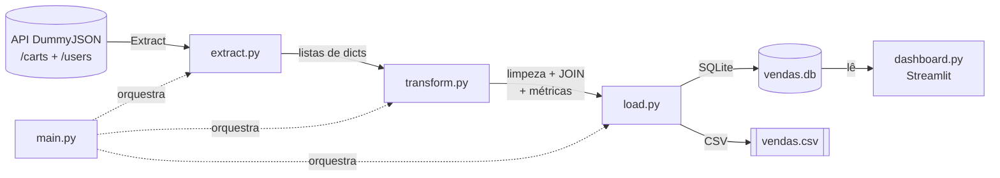
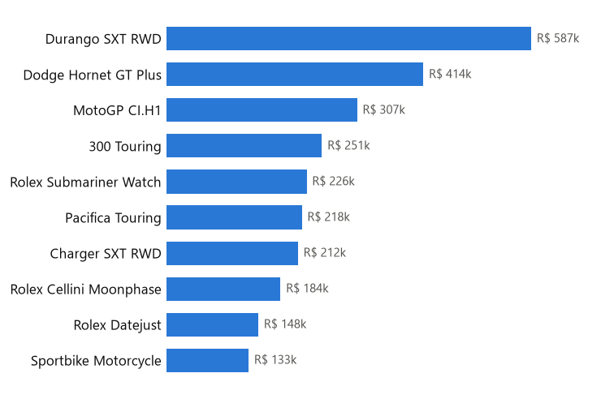
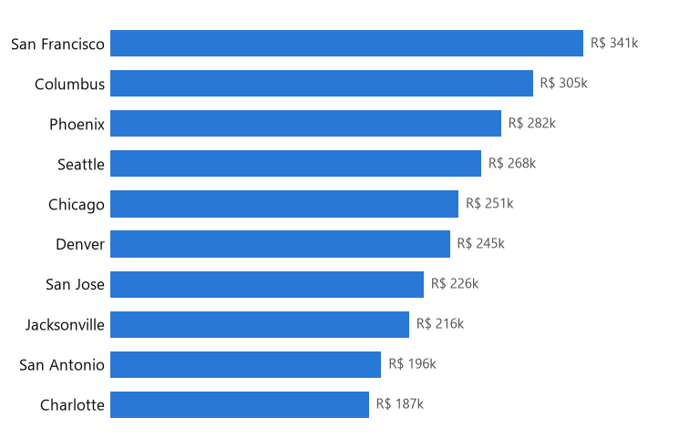

# 🛒 Pipeline ETL de Vendas (Python)

Pipeline **ETL** (Extract, Transform, Load) que coleta dados de e-commerce de uma
API pública real, transforma-os em uma tabela de vendas limpa e enriquecida, e
carrega o resultado em um banco de dados **SQLite** e em **CSV**.

Projeto de portfólio focado em boas práticas: separação de responsabilidades,
logging, tratamento de erros, paginação, join entre fontes e carga idempotente.

---

## 🎯 O que o pipeline faz

| Etapa | O que acontece |
|-------|----------------|
| **Extract** | Coleta pedidos e clientes da API [DummyJSON](https://dummyjson.com), com paginação, `User-Agent` e retentativas automáticas. |
| **Transform** | "Explode" cada pedido em uma linha por item vendido, faz o **JOIN** com os clientes e calcula métricas de negócio (receita bruta, desconto, receita líquida). |
| **Load** | Grava a tabela fato e duas tabelas de resumo em um banco **SQLite**, e exporta a tabela fato em **CSV**. |
| **Dashboard** | App web interativo em **Streamlit** que lê o banco e mostra KPIs, gráficos e filtros por cidade/gênero. |

---

## 🏗️ Arquitetura



---

## 🧰 Tecnologias

- **Python 3.14**
- **pandas** — transformação e agregação dos dados
- **requests** — consumo da API
- **sqlite3** (biblioteca padrão) — banco de dados de destino
- **logging** (biblioteca padrão) — registro de execução
- **Streamlit** + **matplotlib** — dashboard web e gráficos

---

## 📁 Estrutura do projeto

```
ETL/
├── etl/                  # Pacote com a lógica do pipeline
│   ├── __init__.py
│   ├── config.py         # Configurações centrais (URLs, caminhos, parâmetros)
│   ├── extract.py        # Etapa 1: coleta dos dados brutos da API
│   ├── transform.py      # Etapa 2: limpeza, join e métricas
│   └── load.py           # Etapa 3: gravação no SQLite e CSV
├── .streamlit/
│   └── config.toml       # Tema do dashboard
├── data/                 # Saídas geradas (banco e CSV) — ignoradas pelo git
├── logs/                 # Log de execução (etl.log)
├── main.py               # Ponto de entrada do ETL (Extract → Transform → Load)
├── dashboard.py          # Dashboard web interativo (Streamlit)
├── viz.py                # Acesso aos dados + gráficos (usado pelo dashboard)
├── requirements.txt      # Dependências do projeto
├── .gitignore
└── README.md
```

---

## ▶️ Como executar

### Windows (PowerShell)

```powershell
# 1. Criar e ativar o ambiente virtual
py -m venv .venv
.\.venv\Scripts\Activate.ps1

# 2. Instalar as dependências
pip install -r requirements.txt

# 3. Rodar o pipeline
python main.py
```

> 💡 Se o comando `python` abrir a Microsoft Store, use `py` no lugar (fora do venv).

### Linux / macOS

```bash
python3 -m venv .venv
source .venv/bin/activate
pip install -r requirements.txt
python main.py
```

### Abrir o dashboard

Depois de rodar o ETL (o dashboard lê o banco `data/vendas.db`):

```bash
streamlit run dashboard.py
```

O app abre no navegador em `http://localhost:8501` com KPIs, gráficos e
filtros interativos por cidade e gênero.

---

## 📊 Resultado de uma execução real

```
================================================
        RESUMO DO PIPELINE DE VENDAS
================================================
  Pedidos processados ....          208
  Itens vendidos .........        2,417
  Receita bruta .......... R$  3,834,278.63
  Desconto concedido ..... R$    377,569.05
  Receita líquida ........ R$  3,456,709.58
  Ticket médio/pedido .... R$     16,618.80
================================================
```

### Tabelas geradas no banco `data/vendas.db`

**`vendas`** — tabela fato (800 linhas, 1 por item vendido):

| pedido_id | cliente_nome | cidade | produto | quantidade | receita_liquida |
|-----------|--------------|--------|---------|-----------:|----------------:|
| 1 | Emily Johnson | Phoenix | Blue Frock | 4 | 105.41 |
| 1 | Emily Johnson | Phoenix | Generic Motorcycle | 3 | 10547.97 |
| 1 | Emily Johnson | Phoenix | iPhone 6 | 3 | 839.76 |

**`top_produtos`** — produtos que mais faturaram:

| produto | quantidade_vendida | receita_liquida |
|---------|-------------------:|----------------:|
| Durango SXT RWD | 19 | 587426.64 |
| Dodge Hornet GT Plus | 17 | 413822.33 |
| MotoGP CI.H1 | 22 | 307163.78 |

**`resumo_por_cidade`** — receita agregada por cidade do cliente.

---

## 📈 Dashboard interativo

App em **Streamlit** que lê o banco gerado pelo ETL e permite explorar as vendas
com filtros por **cidade** e **gênero**. Traz cartões de KPIs, dois gráficos e a
tabela detalhada.

| Top produtos por receita | Receita por cidade |
|:---:|:---:|
|  |  |

Os gráficos seguem boas práticas de visualização: **uma cor por identidade**,
ordenados por magnitude, com o valor escrito diretamente na ponta de cada barra
(dispensando o eixo) e paleta segura para daltonismo.

```bash
streamlit run dashboard.py
```

---

## 🔍 Exemplo de consulta ao banco

```sql
-- Receita líquida por cidade, das que mais venderam para as que menos venderam
SELECT cidade, pedidos, receita_liquida
FROM resumo_por_cidade
ORDER BY receita_liquida DESC
LIMIT 10;
```

Você pode explorar o banco com o [DB Browser for SQLite](https://sqlitebrowser.org/)
ou direto no Python com `pandas.read_sql`.

---

## 🚀 Possíveis melhorias (próximos passos)

- [x] Criar um dashboard interativo (Streamlit) lendo o banco gerado
- [ ] Agendar a execução automática (Agendador de Tarefas do Windows / cron)
- [ ] Adicionar testes automatizados com `pytest`
- [ ] Validar o schema dos dados com `pydantic` ou `pandera`
- [ ] Trocar o SQLite por PostgreSQL para um cenário mais próximo de produção

---

## 👤 Autoria

Projeto desenvolvido por Emanuel Alan Matos, como estudo do curso de **Análise e Desenvolvimento de Sistemas**.
